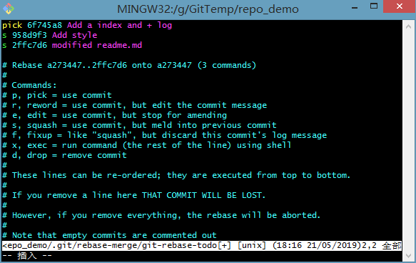
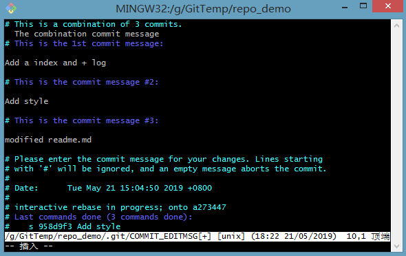
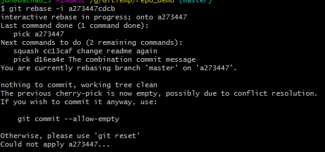
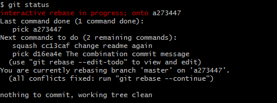
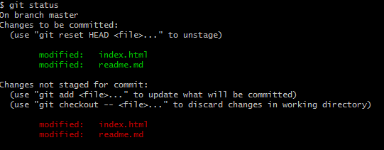

### 1.配置user信息

配置user.name和user.email

```code
$git config --global user.name 'your_name'
$git config --global user.email 'your_email@domain.com'
```
以上设置的内容实际会反应到.git/config文件中，所以也可以通过直接修改.git/config文件中的相应条目来修改user信息

global有什么用呢？config的三个作用域：
```code
$git config --local 只对某个仓库有效
$git config --global 对当前用户所有仓库有效（常用）
$git config --system 对系统所有登录的用户有效
$git config --list显示所有配置
```


### 2.仓库创建

- 把已有项目代码纳入Git管理
```code
$cd 项目代码所在的文件夹
$git init
```
- 新建的项目直接用Git管理
```
$ cd 某个文件夹
$ git init your_project # 会在当前路径下创建和项目同名的文件夹
$ cd your_project
```
- 在项目中可以手动指定local的config
```
$git config --local user.name 'new_name'
$git config --local user.email 'new_email'
$git config --local --list # 查看是否生效
```
此时local的优先级比global高

### 3. 查看日志
```
git log # 只查看当前分支的历史
git log --all # 查看所有分支历史
git log --all --graph # 以图形化的方式查看
git log --oneline # 一条历史一行
git log -n4 # 查看最近四条历史
git log -n2 --oneline # 查看最近两条历史，一条一行
git help --web log # 通过浏览器查看log的使用手册
```
以上选项可组合使用。
也可以使用gitk命令来通过图形界面工具来查看版本历史。在项目目录下：
```
$gitk
```

### 4. 添加文件
工作目录----git add files--->暂存区----git commit---->版本历史
- 对于新添加，尚且未被仓库跟踪的文件，通过git add filename来添加到暂存区
- 而对于只修改了被仓库跟踪的文件，通过git add -u可实现将所有已跟踪文件一起提交至暂存区

### 5. 查看仓库状态
```
$git status
```

### 6.文件重命名
```
1. 修改文件名
2. git add 新命名文件
3. git rm 旧命名文件
```
但是以上需要三步，简洁的做法是：
```
git mv 旧命名文件 新命名文件
```
以上只需一步

### 7.复原环境
```
git reset --hard
```
这个命令能够实现丢弃存在暂存区的修改，恢复环境，所做的修改将被丢弃。对项目进行的所有修改（处于暂存区的）都会被放弃。**该命令应谨慎使用**

### 8.分支
查看分支
```
git branch -v
```
增加分支
```
git checkout -b new_branch_name
```
切换分支
```
git checkout branch_name
```
删除分支
```
git branch -d branch_name # 没有被merge的分支无法删除，如果确实要删除可用-D
git branch -D branch_name # 强制删除 
```
分支切换时，整个项目内容也会相应的变化成branch_name分支对应的内容。虽然项目同在一个文件目录下，但是切换的时候该目录下的内容是会跟着改变的。

### 9.通过哈希值查看对应的类型
```
git cat-file -t 59a4b32bf8c
```
可以显示对应的是commit、tag等。
```
git cat-file -p 59a4b32bf8c
```
以上命令可查看对应的内容

### 10.Git中的三大对象（Commit,Blob,Tree)

### 11.分离头指针
所有commit都应该和某个分支绑定，否则所有在分离头指针上的commit会被git清除掉

### 12.怎么修改最新commit的message？
针对修改最近一次的提交信息
```
git commit --amend
```
### 13.怎么修改老旧commit的message？
假设修改历史为：
```
commit 55b24e3d08b4ff2f31f221fab747cfae5a26ec23 (HEAD -> master)
Author: BugSurvivor <jiandahao@gmail.com>
Date:   Tue May 21 15:07:16 2019 +0800

    Add style

commit a0c16685b7de4d3ebc2a9b354cf7032ea2105e45
Author: BugSurvivor <jiandahao@gmail.com>
Date:   Tue May 21 15:04:50 2019 +0800

    Add index and + log

commit a273447cdcb8d3a35ca1e2bc13e39c8819a34021
Author: BugSurvivor <jiandahao@gmail.com>
Date:   Tue May 21 14:45:30 2019 +0800

    add readme

```
此时想要修改<Add index and + log>这条message，方法如下
```
git rebase -i a273447cdcb8d
```
a273447cdcb8d是想要修改的commit对应的父commit的哈希值，不一定要写成a273447cdcb8d3a35ca1e2bc13e39c8819a34021，只要能够保证唯一性就行。
然后会出现操作的交互界面，根据Command说明进行修改，保存退出后自动进入另一个交互界面，此时直接修改内容就行。
**注意：只针对本地仓库修改，如果已经push贡献到远程集成分支上就不能轻易这么做了。**

### 14.怎样把连续的多个commit整理成1个？
```
commit 2ffc7d6e01cec3e1ce204f39254a6325c72698cb (HEAD -> master)
Author: BugSurvivor <jiandahao@gmail.com>
Date:   Tue May 21 17:34:40 2019 +0800

    modified readme.md

commit 958d9f3951187d07255cc54b5178e0d1d6542303
Author: BugSurvivor <jiandahao@gmail.com>
Date:   Tue May 21 15:07:16 2019 +0800

    Add style

commit 6f745a8d83749c074472bef7c3df07a577edc4ed
Author: BugSurvivor <jiandahao@gmail.com>
Date:   Tue May 21 15:04:50 2019 +0800

    Add a index and + log

commit a273447cdcb8d3a35ca1e2bc13e39c8819a34021
Author: BugSurvivor <jiandahao@gmail.com>
Date:   Tue May 21 14:45:30 2019 +0800

    add readme

```
假设想将<Add style>、<modified readme.md>和<Add a index and + log>合并为一个commit。
```
git rebase -i a273447cdcb8d
```
进入交互界面，选择合适的策略:
	


保存后进入另一个交互界面，根据注释添加新的commit message
	

	
如此<Add style>、<modified readme.md>和<Add a index and + log>就合并为一个commit了

### 15.怎样把间隔的几个commit整理成1个？
参照<**怎样把连续的多个commit整理成1个**>,不一样的是要将需要合并的commit写在连续行中。如果要合并到祖先commit中，那么reabse -i接的hash值选择祖先commit对应的hash值，然后进入交互界面后，在第一行添加pick <祖先hash> [commit message(也可以不写)].
可能出现以下情况



查看status可见



解决方法一（目前测试发现不行），根据提示执行
```
git rebase --continue
```
### 16.you need to resolve your current index first怎么解决
因为产生了冲突。故需要回退到合并前。解决方案如下：
```
git reset --merge
```

### 17.怎么比较暂存区和HEAD所含文件的差异？
```
git diff --cached # 默认显示所有文件的差异
git diff --cached readme.md # 指定关心的文件(也可以指定多个文件)，过滤掉其他文件
```
将显示当前更改的详细信息。对于已经被修改且被add到暂存区进行更新的文件，可以用此命令来查看HEAD所含文件与暂存区文件的差异，以便确保是否要进行commits。

### 18.怎么比较工作区和暂存区所含文件的差异？
```
git diff # 默认显示所有文件的差异
git diff readme.md # 指定关心的文件(也可以指定多个文件)，过滤掉其他文件
```
`diff`默认情况下比较的是工作区与暂存区的差异。对于已经被修改但还没有add到暂存区更新的文件，可以用此命令来查看当前够改了什么。

### 19.如何让暂存区恢复成和HEAD的一样？
```
git reset HEAD # 撤销所有暂存区中的改动
git reset HEAD <file> #指定文件
```

### 20.如何让工作区的文件恢复为和暂存区一样？
工作区文件与暂存区不一致的情况为类似



```
git checkout -- <file> # 可以同时指定多个文件
```
当工作区所做更改不想要了，想要恢复暂存区的内容，则可使用该命令。

### 21.怎样取消暂存区部分文件的更改？
```
git reset HEAD <file> #可指定多个文件
```

### 22.消除最近的几次提交
```
git reset --hard <想要回退到的commit哈希值>
```
这会是工作区恢复到退到的commit对应的状态，所有新的commit提交都会被丢弃。**该操作不可逆，要慎用！**

### 23.看看不同提交的指定文件的差异
```
git diff branch_1[或对应的hash] branch_2[或对应的hash]  # 分支名默认指向最新的一次提交
git diff branch_1 branch_2 -- <感兴趣的文件名>
git diff commit_1_hash commit_2_hash
```

### 24.删除文件的正确姿势
```
git rm <file>
```
### 25.开发中临时加塞了紧急任务怎么处理？
通过命令
```
git stash
```
将当前的状态先保存起来（其实相当于将当前状态入栈），之后工作区将是上一次commit之后的状态。此时进行紧急任务处理，处理完并commit后，执行
```
git stash apply 
或者
git stash pop
```
就可以将暂存的更改弹出并**merge**到当前工作区中。查看stash状态的命令为
```
git stash list
```
通过
```
git stash drop
```
来删除最近的一个stash。stash用法如下
```
git stash list [<options>]
git stash show [<stash>]
git stash drop [-q|--quiet] [<stash>]
git stash ( pop | apply ) [--index] [-q|--quiet] [<stash>]
git stash branch <branchname> [<stash>]
git stash save [-p|--patch] [-k|--[no-]keep-index] [-q|--quiet]
	     [-u|--include-untracked] [-a|--all] [<message>]
git stash [push [-p|--patch] [-k|--[no-]keep-index] [-q|--quiet]
	     [-u|--include-untracked] [-a|--all] [-m|--message <message>]]
	     [--] [<pathspec>…​]]
git stash clear
git stash create [<message>]
git stash store [-m|--message <message>] [-q|--quiet] <commit>
```

### 25.如何指定不需要Git管理的文件？
通过`.gitignore`文件来指定。常见一些编程语言对应的`.gitignore`可参考<https://github.com/github/gitignore>。
可以自己编写或添加不想被Git管理的文件规则。

### 26.如何将Git仓库备份到本地？
**关于常用协议**

| 常用协议       | 语法格式                                                                   | 说明                      |
|----------------|----------------------------------------------------------------------------|---------------------------|
| 本地协议(1)    | /path/to/repo.git                                                          | 哑协议                    |
| 本地协议(1)    | file:///path/to/repo.git                                                   | 智能协议                  |
| http/https协议 | http://git-server.com/pathtorepo.git https://git-server.com/pathtorepo.git | 平时接触到的 都是智能协议 |
| ssh协议        | user@git-server.com:path/to/repo.git                                       | 工作中最常用 的智能协议   |

```
git clone --bare <path_to_repo.git> # 将裸仓库下载到本地
git push -u <remote> <branch> # 备份到远端remote的branch分支
```

### 27. 把本地仓库同步到github
```
git pull # 实际上相当于先执行git fetch，然后将远端master与本地master进行merge
git fetch # 将远程拉取到本地
```

### 28.不同人修改了不同文件如何处理？
通过fetch、merge命令进行同步
```
git fetch
git merge <remote>/<branch>  # 例如git merge origin/master
```
或者直接
```
git pull
```

有三种情况：不同人修改了不同文件如何处理；不同人修改了同文件的不同区域如何处理；不同人修改了同文件的同一区域如何处理。对于前两种情况，通过`git fetch;git merge`或者`git pull`后重新提交`commit`即可，而对于第三种情况，则需要进行手动核对，确定需要更改的内容，冲突的地方将显示类似
```
<<<<<<<<<<<HEAD
(content1)
=========
(content2)
>>>>>>>>>>>origin/branch
```

### 29.同时变更了文件名和文件内容如何处理？
假设A更改了文件index.html的命名为index.htm， 并且push了仓库
B不知道A所做的更改，在本地仓库往index.html中添加新的内容，此时push会报错,类似
```
! [rejected]        features/add_commands -> features/add_commands (non-fast-forward)
```
`non-fast-forward`的错误，此时直接
```
git pull
```
即可解决问题。

### 30.把同一文件改成了不同的文件名如何处理？
假设A将文件index.htm更改为index1.htm, 并提交`push`
B不知道A所做的改变，将index.htm更改为index2.htm，此时直接提交会报错，
报错信息类似：
```
! [rejected]        features/add_commands -> features/add_commands (fetch first)
```
此时进行
```
git pull
```
会报以下错误
```
CONFLICT (rename/rename): Rename "index.htm"->"index2.htm" in branch "HEAD" rename "index.htm"->"index1.htm" in "73a20841a1cb453a5f7190208a5c4d920bb3456b"
Automatic merge failed; fix conflicts and then commit the result.
```
说明出现了命名冲突，此时B的本地仓库中同时存在index1.htm和index2.htm，查看仓库状态`git status`，可以看到
```
$ git status
On branch features/add_commands
Your branch and 'origin/features/add_commands' have diverged,
and have 3 and 1 different commits each, respectively.
  (use "git pull" to merge the remote branch into yours)
You have unmerged paths.
  (fix conflicts and run "git commit")
  (use "git merge --abort" to abort the merge)

Unmerged paths:
  (use "git add/rm <file>..." as appropriate to mark resolution)

        both deleted:    index.htm
        added by them:   index1.htm
        added by us:     index2.htm

no changes added to commit (use "git add" and/or "git commit -a")
```
此时需要开发人员之间进行协商，确定最终的方案，然后通过`git rm`命令将不需要的文件删除，通过`git add`添加需要的文件，最后进行`git commit`

### 31.禁止向集成分支执行push-f操作
### 32.禁止向集成分支执行变更历史的操作

### 33.`fatal: refusing to merge unrelated histories`(拒绝合并不相关的历史)
在github端创建新的项目并建立README后，又在本地`git init`初始化仓库而且进行文件`add`和`commit`操作，此时再`pull`和'push'都会出错。出现这个问题的最主要原因还是在于本地仓库和远程仓库实际上是独立的两个仓库。可以在pull命令后紧接着使用`--allow-unrelated-histories`选项来解决问题（该选项可以合并两个独立启动仓库的历史）。
```
$ git pull origin master --allow-unrelated-histories
```
### 34. 修改远程仓库地址
方法有三种：

1直接修改
```bash
git remote set-url origin [url]
```
2先删后加
```bash
git remote rm origin
git remote add origin [url]
```
3. 直接修改config文件

### 35. 拉取远程分支
```bash
git fetch
```
此时`git branch`发现并没有除了本地分支外的其他分支,此时只需要执行`checkout`到指定的分支即可
```bash
git checkout <specified-branch>
```

### 36. .gitignore
https://www.cnblogs.com/kevingrace/p/5690241.html

如果需要忽略的文件已经被纳入了版本管理，那么可以通过以下方式进行解决
```bash
git rm -r --cached <folder/file>
git add <folder/file>
```
先把相关文件或文件夹变为untracked，然后再添加到git仓库中。

### 37. git reset --hard恢复
[参考原文链接](https://blog.csdn.net/wangyueshu/java/article/details/90919019)
有时
有时不小心执行了git reset --hard后发现后悔了，或者忘记commit了。

解决办法：

一、没有commit，没有add

对不起，找不回了，放弃吧。

二、没有commit，但是有add操作

执行：git fsck --lost-found

在项目git目录下的 /.git/lost-found/other里有你add过的文件。挨个看看，能救回来多少是多少吧。
再附送一个命令：find .git/objects -type f | xargs ls -lt | sed 60q

找回本地仓库里边最近add的60个文件。找回思路同上。

三、执行过commit

好吧，你很幸运。

执行 git  reflog

会有类似下面的东西，挑你想回退的地方，一般是那次commit之前的head，例如 HEAD@{7}

执行 git reset --hard HEAD@{7} 

对于没有commit 但是add的情况，找回的文件可能需要进行重命名。

### 38. 合并merge (squash merge)
```bash
git merge --squash dev
```
Squashing lets you tidy up the commit history of a branch when accepting a merge
request. It applies all of the changes in the merge request as a single commit,
and then merges that commit using the merge method set for the project.
In other words, squashing a merge request turns a long list of commits into a single commit on merge

### 39. git checkout
在需要清除当前工作区改动的时候，需要注意`git checkout`和`git checkout --`的区别
```
I seem to recall that the -- is a way to tell Git to treat what follows checkout as a file and not as a branch. Suppose that you had both a file and a branch called stuff. Then the following command would seem ambiguous:

git checkout stuff
because it is not clear whether you are asking to checkout a file or a branch. By using -- you explicitly tell Git to checkout a file by that name/path. So in this case the following commands allow checking out a branch and a file called stuff:

git checkout stuff       # checkout the branch stuff
git checkout -- stuff    # checkout the file stuff
Note that git checkout <name> is really meant for branches, but Git syntax is relaxed, and if Git can't find a branch, then it will look for a file.
```
